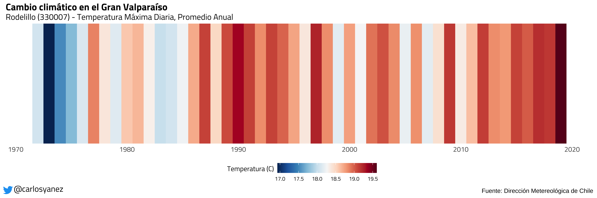

# Temperature in Rodelillo (Chile)

Yearly averages of daily high temperature, as recorded at
[Rodelillo](https://www.google.com/maps/place/Aer%C3%B3dromo+Rodelillo/@-33.0709523,-71.5549868,15.7z/data=!4m13!1m7!3m6!1s0x9689de2c16ee3dad:0x81d2987d998c40b5!2sAv+Rodelillo,+Valpara%C3%ADso,+Chile!3b1!8m2!3d-33.0571386!4d-71.5768301!3m4!1s0x9689de32fe9d5d33:0xe28ed4eb3ab90a6c!8m2!3d-33.066244!4d-71.557796), Viña del Mar (Chile).

Tweeted [here](https://twitter.com/carlosyanez/status/1351463740714213376?s=20).

Data: [Dirección Meteológica de Chile](https://climatologia.meteochile.gob.cl/application/historicos/datosDescarga/330007)
